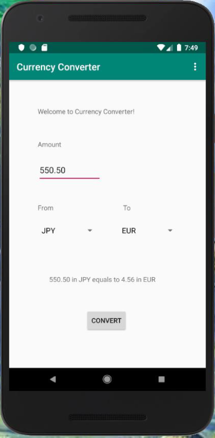
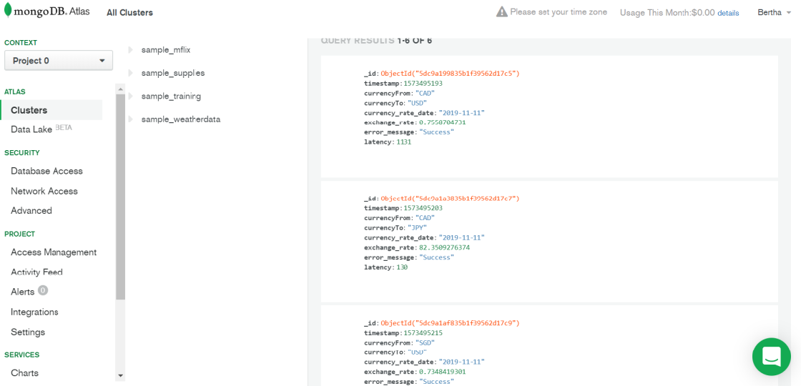
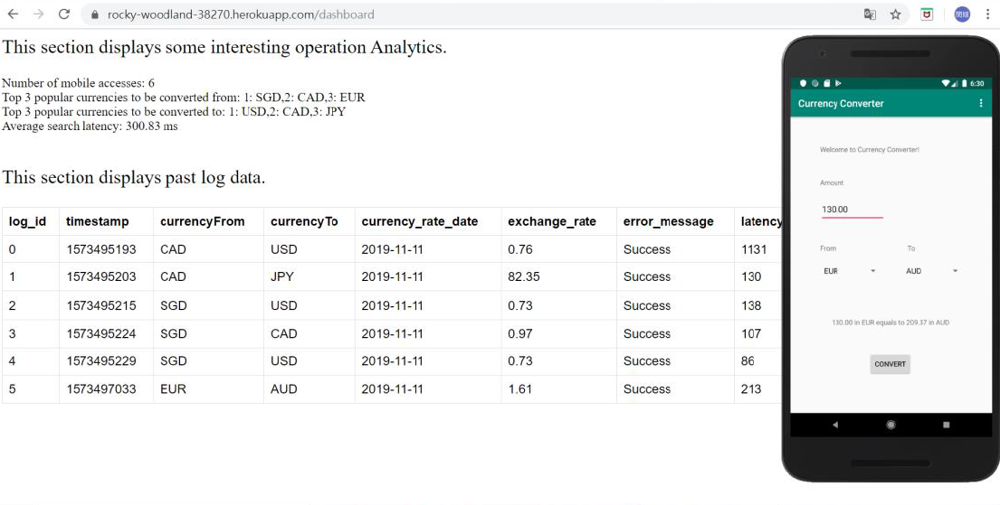

## Description
---
This repo contains the source code of developing a currency converter mobile app and its web backend.

### Technology Stack
* Languages: Java, HTML
* Packages: Servlet, Android
* IDE: IntelliJ IDEA
* Database: MongoDB-as-a-service
* Deployment: Docker, Heroku

### Learning Points About This Project
1. Building a backend server that communicates with the clients and 3rd party APIs using HTTP.
2. Implementing multiple RESTful APIs on the server to support different functionalities/services.
3. Designing an Android application, primarily the main activities and the user interface.
4. Using an asynchronous thread to communicate with the server without blocking the app's UI.
5. Building a backend server that communicates with clients using HTTP
6. Storing mobile user log data to a NoSQL-database-as-a-service.
7. Building a web-based dashboard to display and monitor user statistics.
8. Dockerizing the backend server and deploying it to the cloud as a web service.
---
## Components
---
### Backend Server
* View [source code](BackendServer/src)
* View [user statistics layout](BackendServer/web/dashboard.jsp)

### Android App
* View [source code](AndroidApp/app/src/main/java/edu/cmu/minhsuah)
* View [user interface layout](AndroidApp/app/src/main/res/layout/content_main.xml)
---
## Working Sample
---
* The app prompts the user to select from the pulldown menu a pair of local/foreign currencies and the amount to be exchanged.
* After submission, the app will display the exchanged amount in foreign currency.

* View user log data in the database.

* View interesing user statistics.

 
